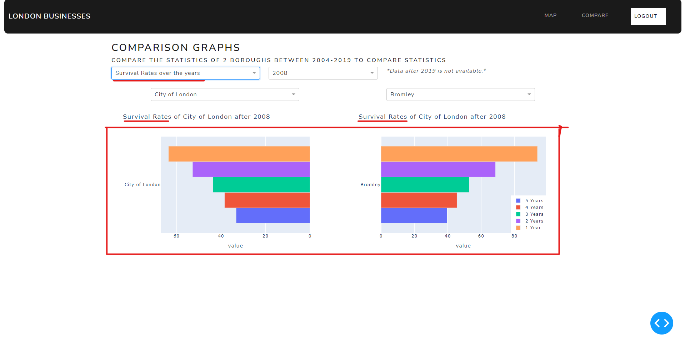

# Visualisation Design

This README file aims to explain and evaluate the visualisations created on the Dash app with respect to the target
audience and the questions that were answered using the visualisations.

[Link to GitHub repository](https://github.com/ucl-comp0035/comp0034-cw1-i-team10)

[Link to video demonstration](https://youtu.be/ucaWbOE6Cjs)

## Target Audience

The target audience for this web app can be shown in the persona above. Our target audience is generally a middle-aged
male who is married and has 2 children. He has just started his own business after working in a large corporate firm for
a long time and has worked hard to gain the status and money that he has earned. Right now, his business is growing, and
he is employing more employees in his company and while doing so trying to find a suitable area to set up an office.
With this webapp, he should be able to find a suitable area to start up his business and sustain after many years there.

On a day-to-day basis, the persona uses a laptop and smartphone regularly and uses apps like Facebook, Waze, Zoopla,
YouTube and Twitter. For this app to be successful, the persona feels that the app should have an easy-to-use UI,
informative data, and it must be interactive so that it gauges his attention.

## Questions to be addressed

1. Which boroughs in London have the highest birth-death rates over the years?
2. Which boroughs in London have the most consistent survival rates over the years?
3. Are there any trends in birth, death and survival rates as time passes?
4. Are there any trends between geographical location of London boroughs and their birth-death rate percent?
5. How many active enterprises are present in each London borough at a particular year?

Looking at the target audience above, these are 5 important questions that will need to be considered before the persona
can decide where to set up his business to have the best chance of success. Our webapp should contain the visualisations
necessary to answer these questions.

## Explanation and Evaluation of Visualisations

### Page 0 - Home Page

#### Visualisation 1 - Home Page

The first visualisation shows the landing page that the user is directed to when the webapp is first launched.
Underneath the main menu title there are options for the 2 different graphs available, each having its own preview image
and short description to help the user easily choose which graph is the most relevant to answer the questions above. The
use of bright colours and images helps engage the user's interest, and the simple user interface ensures there is no
unnecessary content or distractions.

The black navigation bar has an ergonomic design contains a simple logo that redirects users back to the home page when
clicked on, and the right-hand corner contains links to the map and comparison graphs so that the user does not need to
return to the home page to swap between visualisations for ease of navigation.

Due to the fact that the user regularly uses a smartphone, there is a chance that the browser page will be minimised to
a subsection of the entire screen. The webapp compensates by implementing a responsive design by stacking graphs and
visualisations vertically on top of one another when necessary so the user can simply scroll to access them easily.

### Page 1 - Choropleth Map Page

#### Visualisation 2 - Landing Page

This visualisation shows page 1 of our multi-page app which is the landing page for the choropleth map graphs. The
purpose of this web page is to effectively visualise the trends in birth, death and survival rates of the boroughs.
Firstly, there is a description underneath the title which tells the user about some features of graphs and how to
change them. Beneath this, there is a dropdown menu for the user to select a year to explore, with 2004 being the
default value as this is the earliest year available on the dataset. There is also a disclaimer to specify the range of
the dataset.

There are 2 graphs featured on this page. Firstly, on the right-hand side there is a choropleth map which shows the
birth-death rate percentage of all London boroughs in the selected year. The map is colour coded with a legend on the
side to help the user identify the approximate values of the colour range. This visualisation helps answer question 4 as
the colours can easily highlight trends between borough location and the birth-death rate percent.

On the left-hand side there is a grouped bar chart that shows business survival rates after 5 years of the selected
year. This bar chart is also colour coded with a legend on the side to help users more easily differentiate between
individual bars. This graph has the City of London as its default borough selection due to it being very central and
popular, however this selection can be changed by the user by clicking on the choropleth map which will be showcased in
a later visualisation. We chose to use a bar chart because it easily shows how survival rate changes over time as the
bars decrease in height. Additionally, there is a lack of 'chartjunk' as there is no shading or distracting figures
unless if the user deliberately hovers above to see more information. However, the bar chart could be further improved
if the grid was removed as it would further simplify the graph.

#### Visualisation 3 - Changing dates

This visualisation shows what happens when the user changes the date from the dropdown menu. As highlighted in red, the
choropleth map on the right-hand side will change - repopulating itself with new data from the selected year. Using this
feature, question 1 can be answered as the user can change the selected years and visualise the changes in birth-death
rates as the colours on the map change. The title above the choropleth map changes as well to reflect the change in year
selection.

The survival rates bar chart on the left-hand side does not change yet when updating the selection year. This is because
the user has not clicked on the choropleth map to change borough selection. This feature will be explained in a later
visualisation. We decided to implement this to avoid showing the user information that may not have been wanted at the
time and this gives the user more control over exactly what they want to see at any time.

#### Visualisation 4 - Hover data

Aside from changing the dates, the user can obtain additional information about each borough by hovering their mouse
over the choropleth map as shown in the red highlight. This brings up more statistics such as active enterprises,
births, birth rate and death rate. This detailed data can help answer several questions. Firstly, question 5 can be
addressed because the user can hover over different boroughs to find out how many active enterprises there are in any
particular year. Furthermore, question 1 and 4 can be addressed in more detail because hovering over the boroughs gives
exact birth-death rate percentages which can be used to analyse trends more closely. The data is shown in a black box to
help contrast against the bright colours of the map which helps it stand out to the user.

To help maneuver the map, there is a toolbar which can be seen in the upper right corner of the choropleth map. This
toolbar supports zooming, panning and double-tapping to reset the view of the map. The user can either manipulate the
map using mousepad gestures, or alternatively click on the appropriate tool icons to move the map as required.

#### Visualisation 5 - Click data

For the final visualisation of page 1, we have configured the bar chart on the right to update itself with the 5-year
survival rates of businesses that the user clicks on. When the user clicks on any borough, the bar chart will populate
with the appropriate data for the year that is currently selected by the user. This chart will also update itself if the
user decides to change the selection year from the dropdown. This means that questions 2 and 3 can be solved - survival
rate consistency of a chosen borough can be easily visualised as the user advances through the selection years and any
trends in birth, death and survival rates can be seen as the bar chart updates itself and the user hovers over the
boroughs for precise statistics. The title above the bar chart will also change to reflect the years chosen, and the
x-axis will update to reflect the last clicked borough so the user knows exactly what data is being shown at any time.

### Page 2 - Comparison Graph Page

#### Visualisation 6 - Landing page

This visualisation shows the landing page of the comparison graphs under page 2 of our multi-page app. The purpose of
this page is to assist in comparing the statistics between boroughs so that the user is able to decide and narrow down
on the boroughs selected. Similar to page 1, there is a short description that specifies to the user that this page is
for comparing the different statistics of 2 specified boroughs. There are 4 dropdowns available that allow the user to
select a year, 2 boroughs of their choice and an option to compare either the birth, death and net birth rates or the
survival rates over the years.

By default, birth, death and net birth rates in 2004 between the City of London and Camden is selected. Once again we
have chosen these 2 boroughs as default options due to their popularity and prominence in London. There are 2 horizontal
bar charts side-by-side, each displaying the data for the borough selected on the dropdown above them. Having the graphs
next to each other helps the user address questions 1 and 3 by having the user select 2 specific boroughs to directly
compare against one another as opposed to page 1 which had only a single bar chart display. Also, having the data shown
here as a graph instead of as text means the user can visualise values more easily.

The 2 bar charts also support similar functionality to the graphs on page 1, as the user can hover over the bars to
display the exact value of the data. There is also a simple legend in the bottom-right corner of the second bar chart to
help the user identify the colour coding of the bars. Once again, the graph visualisations do not have 'chartjunk'
because they are simply colour coded with no extra text, but can be improved by removing the vertical grid lines.

#### Visualisation 7 - Changing dates and boroughs

In order to compare any data necessary, the user has the option to change the year and boroughs that are being compared
as highlighted in red on the image. When the year is changed, both bar charts will update themselves with the statistics
from the year chosen and the tiles above the charts will change as well to show this. If the user changes the boroughs
to be compared from the dropdowns, the bar chart data and axes will update themselves and the title will change to
reflect this. This ensures that the user can easily identify what data is being shown and reduces the chance of mistakes
being made when comparing sets of data. By changing the year, question 1 and 2 can be answered as any trends or patterns
can be identified and compared as the years are changed.

Whilst the graphs correctly update themselves to present the information chosen by the user, they can still be improved
upon because the x-axis scale can be squashed when a borough with a long name is selected. This skews the overall graph
proportions and reduces the effectiveness of the visualisation. To improve, boroughs with names over a certain length
could be rotated vertically along the y-axis to save space and maintain the original graph scale.

#### Visualisation 8 - Changing statistics shown

Lastly, this visualisation shows the changes made when the user decides to compare survival rates over the years from
the dropdown menu. Both chart titles are updated to identify the data currently being shown on the graphs, and the
graphs themselves are repopulated with thinner bars to fit all the data needed. The colour coding is changed to
accommodate the new bars and the legend is changed to reflect the new colours and keys. Likewise, the hover data shown
on the screen is changed to show the cascading values for the survival rates across the years. This lets the user
compare survival rates between 2 selected boroughs across a range of years which further answers question 3.